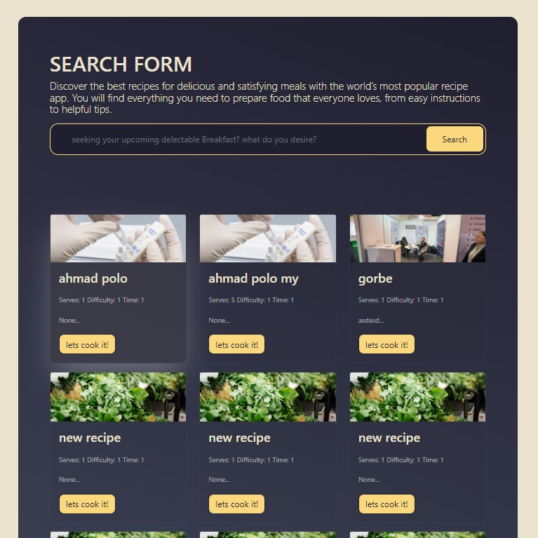

# RecipeRiot

RecipeRiot is a dynamic web application built with Django that empowers users to discover, share, and relish a diverse array of recipes. Inspired by the energetic RecipeRiot theme, this platform enables users to explore recipes, contribute their culinary creations, and connect with a community of passionate food enthusiasts.

## Features

- Navigate an extensive collection of recipes sorted by categories and tags.
- Effortlessly search for recipes using keywords, ingredients, or dish names.
- Create a personalized account to bookmark favorite recipes and submit your own.
- Intuitive recipe submission form with customizable ingredients and steps.
- Engaging recipe pages with clear instructions, appetizing images, and nutritional insights.
- Foster interaction by leaving comments on recipes and engaging with fellow users.
- Responsive design for seamless browsing across diverse devices.

## Screenshots


*Fig. 1: Homepage featuring a captivating selection of highlighted recipes and categories.*


*Fig. 2: Dynamic recipe search functionality with convenient filters and sorting options.*


*Fig. 3: Immersive recipe details page showcasing ingredients, step-by-step instructions, and nutrition details.*


*Fig. 4: User-centric account page for bookmarking cherished recipes and submitting culinary creations.*

## How It Works

1. Users can effortlessly explore a plethora of recipes on the homepage, apply filters by categories and tags, or conduct tailored recipe searches.
2. Clicking on a recipe's image or title leads users to the comprehensive recipe details page, providing insights into ingredients, detailed instructions, and nutritional facts.
3. Registered users have the privilege to create an account, curate a collection of favorite recipes, and contribute their original recipes using the submission form.
4. Users are encouraged to engage with the RecipeRiot community by expressing themselves through recipe comments and interactive discussions.

## Getting Started

To launch RecipeRiot locally:

1. Install Python, Django, and the necessary dependencies.
2. Clone this repository and navigate to the project directory.
3. Establish a virtual environment and install the project dependencies.
   ```bash
   python -m venv venv
   source venv/bin/activate  # On Windows: venv\Scripts\activate
   pip install -r requirements.txt
   ```
4. Execute database migrations.
   ```bash
   python manage.py migrate
   ```
5. Create a superuser account to access the admin panel.
   ```bash
   python manage.py createsuperuser
   ```
6. Launch the development server.
   ```bash
   python manage.py runserver
   ```
7. Access RecipeRiot through your web browser at http://localhost:8000/.

## Contact

For any queries or feedback, feel free to reach out:

Name: Morteza Hatami 
Email: m.hatami@live.com
